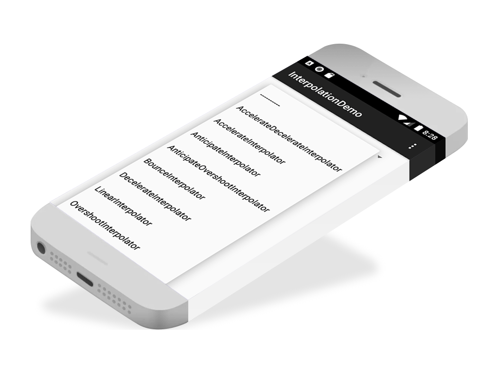

# Interpolator demo - Udacity demo updated

This project is based on the Udacity demo, and the following are the main updates that were added:

* Gradle
* migration to [androidx](https://developer.android.com/jetpack/androidx/migrate)

